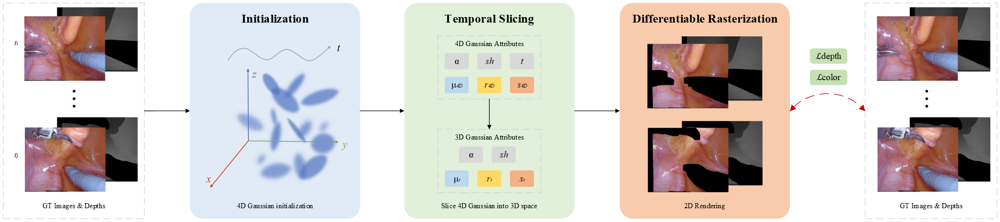

<!-- PROJECT LOGO -->

<p align="center">

  <h1 align="center">SurgicalGS: Dynamic 3D Gaussian Splatting for Accurate Robotic-Assisted Surgical Scene Reconstruction</h1>
  <div align="center">
    <h3><strong>Jialei Chen, Xin Zhang, Mobarakol Islam, Francisco Vasconcelos, Danail Stoyanov, Daniel S. Elson, Baoru Huang*</strong></h3>
    <h3 align="center"> || <a href="https://arxiv.org/pdf/2410.09292">Paper</a> || <a href="https://arxiv.org/abs/2410.09292">Arxiv</a> || </h3>
    <div align="center"></div>
  </div>
  <div align="center"></div>
</p>
<p align="center">
    
  </a>
</p>

## Setup
```bash
git clone https://github.com/neneyork/SurgicalGS.git
cd SurgicalGS
conda create -n SurgicalGS python=3.7 
conda activate SurgicalGS

pip install -r requirements.txt
pip install -e submodules/depth-diff-gaussian-rasterization
pip install -e submodules/simple-knn
```

## Datasets

We use [EndoNeRF](https://github.com/med-air/EndoNeRF) and [StereoMIS](https://zenodo.org/records/7727692) for training and evaluation..

The data structure is as follows:

```
data
| - EndoNeRF
|   | - cutting_tissues_twice
|   |   └── ...
|   | - pushing_soft_tissues
|   |   └── ...
| - StereoMIS
|   └── ...
```

## Training

To train scenes such as pulling_soft_tissues, run
```
python train.py -s data/endonerf/pulling --expname endonerf/pulling --configs arguments/endonerf/default.py 
```

## Evaluation
```
python render.py --model_path output/endonerf/pulling --configs arguments/endonerf/default.py

python metrics.py --model_path output/endonerf/pulling
```

## Acknowledgements

Our work is based on [Deform3DGS](https://github.com/jinlab-imvr/Deform3DGS), [EndoGaussian](https://github.com/CUHK-AIM-Group/EndoGaussian), [depth-diff-gaussian-rasterization](https://github.com/ingra14m/depth-diff-gaussian-rasterization), [3DGS](https://github.com/graphdeco-inria/gaussian-splatting), [EndoNeRF](https://github.com/med-air/EndoNeRF). We thank the authors of relevant repositories and papers.

## Citation

If you find this code useful for your research, please use the following BibTeX entries:

```
@misc{chen2024surgicalgs,
    title={SurgicalGS: Dynamic 3D Gaussian Splatting for Accurate Robotic-Assisted Surgical Scene Reconstruction},
    author={Jialei Chen and Xin Zhang and Mobarakol Islam and Francisco Vasconcelos and Danail Stoyanov and Daniel S. Elson and Baoru Huang},
    year={2024},
    eprint={2410.09292},
    archivePrefix={arXiv},
    primaryClass={cs.CV}
}
```